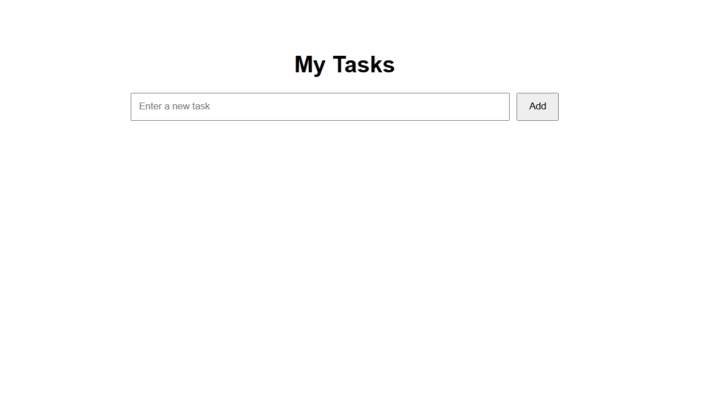
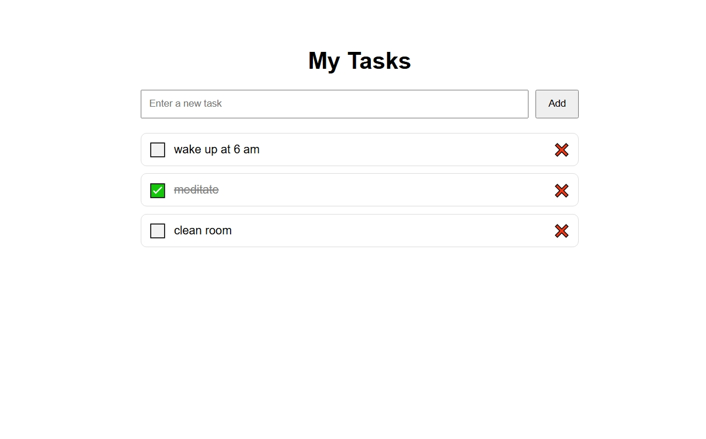

# To-Do App (Flask)

A simple task manager built with Flask.  
This app allows users to add, complete, and delete tasks in a clean and minimal interface.

---

## Features
- Add tasks
- Mark tasks as completed ✅
- Delete tasks ❌

---

## Tech Stack
- Python
- Flask
- HTML
- CSS

---

## Description
This is a simple full-stack web application where users can:
- Manage daily tasks
- Track completed items
- Stay organized

---

## Run locally

```bash
pip install flask
python app.py
```

Open in browser:  
http://127.0.0.1:5000

---

## Preview

### Empty state


### With tasks


---

## Author
Ivo Marinov  
Aspiring Software Developer | Python | Web Development
